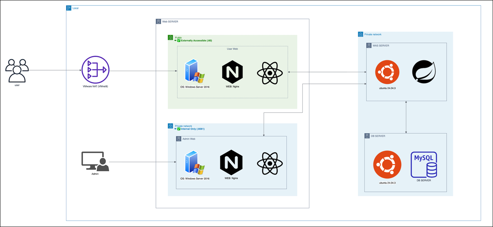
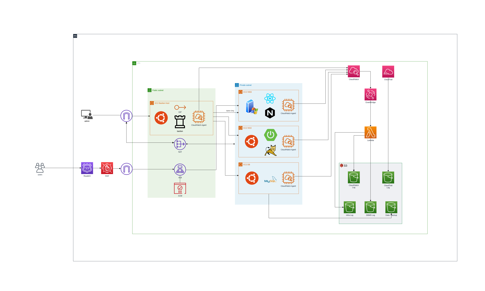

# MyCard - 카드 관리 시스템

카드 발급·관리·포인트·대출 서비스를 제공하는 웹 애플리케이션.  
사용자 포털과 관리자 포털을 분리 운영하며, VMware 기반 3-Tier 아키텍처로 배포합니다.

> **현재 상태**: 모든 보안 취약점 조치 완료 (2026-03-12 기준)

---

## 기술 스택

| 계층 | 기술 |
|------|------|
| **Backend** | Java 21, Spring Boot 3.2.2, Tomcat 10 (Standalone JAR), Spring Security + JWT, JPA/Hibernate, Flyway |
| **Frontend** | React 18, TypeScript 5.7, Vite 6, MUI 5, React Query, React Hook Form + Zod, DOMPurify |
| **Database** | MySQL 8.0 |
| **Web Server** | Windows Server 2016, Nginx (리버스 프록시, React SPA 정적 서빙) |
| **WAS** | Ubuntu 24.04, Tomcat Standalone , systemd |
| **DB Server** | Ubuntu 24.04, MySQL 8.0 |
| **Network** | VMware NAT (VMnet8), Public/Private 네트워크 분리 |

---

## 시스템 아키텍처

### AS-IS (On-Premise / VMware)



| 구분 | 서버 | OS | Port | 접근 범위 |
|------|------|----|------|-----------|
| **Web Server (User)** | Public Zone | Windows Server 2016 + Nginx | :80 | 외부 접근 허용 |
| **Web Server (Admin)** | Private Zone | Windows Server 2016 + Nginx | :8081 | 내부 전용 |
| **WAS Server** | Private Network | Ubuntu 24.04 + Spring Boot | :8080 | Web Server에서만 접근 |
| **DB Server** | Private Network | Ubuntu 24.04 + MySQL 8.0 | :3306 | WAS Server에서만 접근 |

- **사용자** → VMware NAT (VMnet8) → Web Server (:80) → WAS → DB
- **관리자** → Private Network → Admin Web (:8081) → WAS → DB

### TO-BE (AWS 클라우드 마이그레이션)

> 보안 취약점 조치 완료 후 AWS 클라우드로 마이그레이션한 최종 아키텍처



| 구분 | AWS 서비스 | 역할 |
|------|-----------|------|
| **DNS** | Route 53 | 도메인 라우팅 |
| **WAF** | AWS WAF | 웹 방화벽 (SQL Injection, XSS 등 차단) |
| **로드밸런서** | ALB (Application Load Balancer) | User Page 접근, HTTPS 트래픽 분산, ACM 인증서 적용 |
| **SSL 인증서** | ACM (AWS Certificate Manager) | HTTPS 인증서 관리 |
| **WEB (EC2)** | Private Subnet / Ubuntu + Nginx + React | 정적 파일 서빙, API 리버스 프록시 |
| **WAS (EC2)** | Private Subnet / Ubuntu + Tomcat | REST API, JWT 인증, 비즈니스 로직 |
| **DB (EC2)** | Private Subnet / Ubuntu + MySQL | 데이터베이스 |
| **Bastion Host** | Public Subnet / EC2 + EIP | 관리자 페이지 접근, Private Subnet SSH 접근 전용 (Admin Only) |
| **NAT Gateway** | Public Subnet | Private Subnet 인스턴스의 아웃바운드 인터넷 |
| **모니터링** | CloudWatch + CloudWatch Agent | 인프라·애플리케이션 로그 수집, 메트릭 모니터링 |
| **감사 로그** | CloudTrail | AWS API 호출 감사 추적 |
| **이벤트** | EventBridge + Lambda | Log 수집 |
| **스토리지** | S3 | CloudWatch Log, CloudTrail Log, Infra Log, DBMS Log, Data Backup |

#### 네트워크 흐름

- **사용자** → Route 53 → WAF → ALB (ACM) → EC2 WEB → EC2 WAS → EC2 DB
- **관리자** → Bastion Host (EIP, Admin Only) → EC2 WEB/WAS/DB
- 모든 EC2에 **CloudWatch Agent** 배포 → CloudWatch로 로그 중앙 수집
- CloudWatch + EventBridge → Lambda 연동으로 로그 S3로 자동 백업업
- S3에 로그 장기 보관 (Infra Log, DBMS Log, Data Backup)

---

## 프로젝트 구조

```
Final_project/
├── backend/                       # Spring Boot API (Gradle)
│   └── src/main/
│       ├── java/com/mycard/api/
│       │   ├── controller/        # REST 컨트롤러
│       │   ├── service/           # 비즈니스 로직
│       │   ├── entity/            # JPA 엔티티
│       │   ├── dto/               # DTO
│       │   ├── repository/        # JPA Repository
│       │   ├── security/          # JWT, Spring Security, 2차 인증 필터
│       │   ├── validation/        # 비밀번호 정책
│       │   └── config/            # 설정
│       └── resources/
│           ├── application.yml
│           └── db/migration/      # Flyway 마이그레이션 (V1~V100)
├── frontend-user/                 # 사용자 포털 (React + Vite)
├── frontend-admin/                # 관리자 포털 (React + Vite)
├── packages/shared/               # 공통 유틸 (타입, 마스킹, 메뉴)
├── infra/
│   ├── nginx/                     # Nginx 설정 (mycard.conf, admin.conf)
│   ├── systemd/                   # mycard-api.service
│   ├── env/                       # 환경변수 예시
│   ├── sql/                       # DB 최소 권한 설정 예시
│   └── logrotate/                 # 로그 로테이션
├── scripts/
│   ├── security-audit/            # 보안 자동화 진단 스크립트
│   │   ├── unix_security_audit.py     # UNIX 서버 취약점 자동 진단 (67항목)
│   │   ├── windows_security_audit.py  # Windows 서버 취약점 자동 진단 (64항목)
│   │   └── audit_to_excel.py          # 진단 결과 Excel 변환
│   ├── evidence/                  # 보안 증적 수집
│   │   └── export_evidence.sh
│   ├── logging/                   # 중앙 로그 수집
│   │   └── vm3_pull_logs.sh
│   ├── setup_db_server.sh         # DB 서버 초기 설정
│   ├── setup_backend_server.sh    # WAS 서버 초기 설정
│   ├── setup_frontend_server.sh   # WEB 서버 초기 설정
│   ├── deploy_api.sh              # 백엔드 JAR 교체 배포
│   ├── deploy_web.sh              # 프론트엔드 배포 (rsync)
│   └── build_all.sh               # 로컬 전체 빌드
└── docs/                          # 문서
    ├── images/                    # 아키텍처 다이어그램
    ├── auth-policy.md             # 인증 정책
    ├── P0_API_RBAC_MATRIX.md      # API 권한 매트릭스
    ├── rbac-matrix.md             # RBAC 매트릭스
    ├── evidence-runbook.md        # 증적 수집 가이드
    ├── board-sql-injection-remediation.md
    ├── board-xss-remediation.md
    ├── common-error-page-remediation.md
    ├── dashboard-second-auth-remediation.md
    ├── jwt-session-remediation.md
    └── ...
```

---

## 보안 취약점 조치 이력

> 아래 취약점은 개발 과정에서 발견되어 **모두 조치 완료**된 상태입니다.

### 1. SQL Injection (`/board` API) — ✅ 조치 완료

| 항목 | 내용 |
|------|------|
| **발견 위치** | 게시판 검색, 조회, 생성, 수정, 삭제 |
| **취약 원인** | `EntityManager.createNativeQuery()`에 사용자 입력 직접 결합 |
| **공격 예시** | `' OR 1=1 #`, `UNION SELECT ...` |
| **조치 내용** | JPA Repository + `@Query` 파라미터 바인딩으로 전환, 서버 측 입력 검증 (최대 100자, 허용 문자 제한, 카테고리 화이트리스트), DB 최소 권한 가이드 적용 |
| **관련 커밋** | `fec26dd` 서버사이드 SQL Injection 화이트리스트 제거 |
| **상세 문서** | [docs/board-sql-injection-remediation.md](docs/board-sql-injection-remediation.md) |

### 2. Cross-Site Scripting (`/board` UI) — ✅ 조치 완료

| 항목 | 내용 |
|------|------|
| **발견 위치** | 게시판 제목, 본문, 관리자 답변 렌더링 |
| **취약 원인** | `dangerouslySetInnerHTML` 사용, `href={title}` 속성 주입 |
| **조치 내용** | 서버 측 `HtmlUtils.htmlEscape()` 적용, 클라이언트 DOMPurify 통한 이중 방어, `dangerouslySetInnerHTML` 전면 제거 |
| **관련 커밋** | `c115dba` WEB 조치 이행 User Page, `8a25373` admin 및 공통사항 조치 이행 |
| **상세 문서** | [docs/board-xss-remediation.md](docs/board-xss-remediation.md) |

### 3. 에러 페이지 정보 노출 — ✅ 조치 완료

| 항목 | 내용 |
|------|------|
| **발견 위치** | HTTP 400/401/403/404/500 응답 |
| **취약 원인** | 에러 응답에 상태 코드, 스택 트레이스, 내부 경로 노출 |
| **조치 내용** | 단일 공통 에러 페이지(`/error`)로 통합, `ErrorResponse`에서 `status`/`path` 필드 제거, `ErrorBoundary` 컴포넌트로 프론트엔드 전역 에러 캐치 |
| **관련 커밋** | `8a25373` admin 및 공통사항 조치 이행 |
| **상세 문서** | [docs/common-error-page-remediation.md](docs/common-error-page-remediation.md) |

### 4. 2차 인증 우회 (`/dashboard`) — ✅ 조치 완료

| 항목 | 내용 |
|------|------|
| **발견 위치** | 대시보드 및 민감 API 14개 엔드포인트 |
| **취약 원인** | 2차 인증 모달 표시 전 하위 컴포넌트 렌더링으로 데이터 노출, Burp Suite로 API 직접 호출 가능 |
| **조치 내용** | `SecondAuthEnforcementFilter`로 서버 측 2FA 강제, Access Token에 `secondAuthVerified` 클레임 추가, `refresh_tokens` 테이블에 세션 상태 저장, 프론트엔드 `UserLayout`에서 2FA 완료 전 `<Outlet/>` 미렌더링 |
| **관련 커밋** | `c115dba` WEB 조치 이행 User Page, `8a25373` admin 및 공통사항 조치 이행 |
| **상세 문서** | [docs/dashboard-second-auth-remediation.md](docs/dashboard-second-auth-remediation.md) |

### 5. JWT 세션 관리 취약점 — ✅ 조치 완료

| 항목 | 내용 |
|------|------|
| **발견 위치** | 토큰 발급, 로그아웃, 세션 관리 전반 |
| **취약 원인** | 로그아웃 후 토큰 미무효화, Refresh/Access Token 구분 없음, 절대 세션 타임아웃 미적용, 비밀번호 변경 시 기존 세션 미폐기 |
| **조치 내용** | Access Token 유효성을 `refresh_tokens` 테이블과 연동, `type=access/refresh` 클레임 분리, 절대 세션 타임아웃 30일 적용, 토큰 재사용 탐지 시 세션 강제 종료 + `SECURITY_ALERT` 감사 로그 기록, User-Agent 불일치 탐지 |
| **관련 커밋** | `eade599` PEM키 설정, `2cd491b` Fix login lockout and auth error handling |
| **상세 문서** | [docs/jwt-session-remediation.md](docs/jwt-session-remediation.md) |

### 6. 개인정보 마스킹 처리 — ✅ 조치 완료

| 항목 | 내용 |
|------|------|
| **조치 내용** | 카드번호, 주민번호 등 민감 정보 마스킹 유틸 적용 (`packages/shared/src/masking.ts`) |
| **관련 커밋** | `9a0c2ac` 마스킹 처리 |

---

## 주요 기능

### 사용자 포털
- 카드 조회·신청·재발급
- 월별 명세서 조회
- 포인트 조회·전환 (쿠폰 쇼핑몰)
- 대출 신청·조회
- 고객 문의 게시판
- 2차 비밀번호 인증
- 문서함 (업로드/다운로드)

### 관리자 포털
- 회원 관리 (조회, 상태 변경)
- 카드 신청 심사 (승인/거절)
- 대출 심사·실행
- 문의 답변 관리
- 감사 로그 조회
- 시스템 공지/메시지 발송
- 포인트 지급·차감
- 관리자 PEM 키 기반 비밀번호 변경

---

## 인증 및 보안

| 항목 | 값 |
|------|-----|
| Access Token 유효기간 | 15분 |
| Refresh Token 유효기간 | 7일 (갱신 시 회전) |
| 절대 세션 타임아웃 | 30일 |
| 로그인 시도 제한 | 5회 실패 시 잠금 |
| Refresh Token 저장 | SHA-256 해시 (DB) |
| 2차 인증 | 2차 비밀번호 (민감 API 14개 엔드포인트 보호) |
| RBAC | USER / OPERATOR / ADMIN 3단계 역할 |

**인증 흐름**: 로그인 → Access + Refresh Token 발급 → 2차 비밀번호 인증 → `Authorization: Bearer <token>` 헤더로 API 호출 → 만료 시 Refresh Token으로 자동 갱신

전체 인증 정책: [docs/auth-policy.md](docs/auth-policy.md)  
API 권한 매트릭스: [docs/P0_API_RBAC_MATRIX.md](docs/P0_API_RBAC_MATRIX.md)

---

## 로컬 개발 환경

### 사전 요구사항
- Java 21, Node.js 20+, Docker (MySQL용)

### 실행
```bash
# 1. MySQL
docker compose up -d

# 2. Backend (http://localhost:8080/api)
cd backend && ./gradlew bootRun

# 3. Frontend - User (http://localhost:5173)
cd frontend-user && npm install && npm run dev

# 4. Frontend - Admin (http://localhost:5174)
cd frontend-admin && npm install && npm run dev
```

---

## 운영 배포 (3-Tier)

### 배포 스크립트

| 스크립트 | 대상 | 용도 |
|----------|------|------|
| `setup_db_server.sh` | DB Server | MySQL 설치, DB·계정 생성, 방화벽 |
| `setup_backend_server.sh` | WAS Server | Java 21 설치, systemd 서비스 등록, 환경변수 설정 |
| `setup_frontend_server.sh` | Web Server | Node.js·Nginx 설치, vhost 설정 |
| `deploy_api.sh` | WAS Server | JAR 백업 → 교체 → 서비스 재시작 → 헬스체크 |
| `deploy_web.sh` | Web Server | dist rsync → Nginx reload (무중단) |
| `build_all.sh` | 로컬 | 전체 빌드 (`--backend-only`, `--frontend-only` 지원) |

상세 배포 가이드: [docs/DEPLOYMENT_GUIDE.md](docs/DEPLOYMENT_GUIDE.md)  
트러블슈팅: [docs/TROUBLESHOOTING_REPORT.md](docs/TROUBLESHOOTING_REPORT.md)

---

## 환경변수 (`/etc/mycard/mycard-api.env`)

```bash
# 필수
DB_URL=jdbc:mysql://<DB_HOST>:3306/mycard?useSSL=false&allowPublicKeyRetrieval=true&serverTimezone=Asia/Seoul
DB_USERNAME=mycard
DB_PASSWORD=<CHANGE_ME>
JWT_SECRET=<openssl rand -base64 64>
CORS_ALLOWED_ORIGINS=http://<WEB_SERVER_IP>,http://<WEB_SERVER_IP>:8081

# 선택 (기본값 있음)
SPRING_PROFILES_ACTIVE=prod
SERVER_PORT=8080
UPLOAD_PATH=/var/lib/mycard/uploads
```

---

## 서비스 관리

```bash
# Backend (WAS Server)
sudo systemctl start|stop|restart|status mycard-backend
sudo journalctl -u mycard-backend -f

# Nginx (Web Server)
sudo nginx -t && sudo systemctl reload nginx

# MySQL (DB Server)
sudo systemctl status mysql
```

---

## 보안 자동화 진단 (`scripts/security-audit/`)

주요정보통신기반시설 기술적 취약점 분석·평가 기준에 따른 자동 진단 도구입니다.

| 스크립트 | 대상 | 점검 항목 수 | 실행 권한 |
|----------|------|-------------|-----------|
| `unix_security_audit.py` | Ubuntu/Linux 서버 | 67개 (U-01 ~ U-67) | root |
| `windows_security_audit.py` | Windows 서버 | 64개 (W-01 ~ W-64) | Administrator |
| `audit_to_excel.py` | 결과 변환 | — | 일반 |

### 점검 카테고리

**UNIX (67항목)**: 계정관리, 파일/디렉터리 관리, 서비스 관리, 패치 관리, 로깅

**Windows (64항목)**: 계정관리, 서비스 관리, 패치 관리, 로깅, 보안 관리

### 실행 방법

```bash
# UNIX 서버 취약점 점검 (root 권한 필요)
sudo python3 scripts/security-audit/unix_security_audit.py

# Windows 서버 취약점 점검 (관리자 권한 필요)
python scripts/security-audit/windows_security_audit.py

# 점검 결과 JSON → Excel 변환
python3 scripts/security-audit/audit_to_excel.py <audit_results.json> [output.xlsx]
```

### 출력 형식
- **JSON**: 호스트명, OS, 점검 시간, 항목별 판정(양호/취약/N·A/수동점검필요)
- **Excel**: 통계 요약 시트 + 판정 파이 차트 + 카테고리별 상세 결과 (색상 구분)

점검 항목 상세:
- [docs/UNIX 서버 취약점 분석 평가 항목.md](docs/UNIX%20서버%20취약점%20분석%20평가%20항목.md)
- [docs/01 Windows 서버 취약점 분석 평가 항목.md](docs/01%20Windows%20서버%20취약점%20분석%20평가%20항목.md)

---

## 증적 수집

보안 감사 및 포렌식을 위한 증적 자동 수집 도구를 제공합니다.

```bash
# 증적 패키징 (WAS 로그 + Nginx 로그 + DB 감사 레코드)
CASE_ID=CASE-001 FROM=2026-03-01 TO=2026-03-31 \
  DB_USER=mycard_app DB_PASS='***' \
  ./scripts/evidence/export_evidence.sh

# 분산 서버 로그 중앙 수집 (DB 서버에서 실행)
WEB_HOST=<WEB_IP> WAS_HOST=<WAS_IP> SSH_USER=mycard \
  ./scripts/logging/vm3_pull_logs.sh
```

상세 가이드: [docs/evidence-runbook.md](docs/evidence-runbook.md)

---

## 테스트 계정

| 역할 | 이메일 | 비밀번호 |
|------|--------|----------|
| 사용자 | user1@mycard.local | MyCard!234 |
| 사용자 | user2@mycard.local | MyCard!234 |
| 심사관리자 | reviewadmin@mycard.local | MyCard!234 |
| 상담원 | op1@mycard.local | MyCard!234 |
| 상담원 | op2@mycard.local | MyCard!234 |
| 마스터관리자 | masteradmin@mycard.local | MyCard!234 |

---

## 주요 API

| Method | Endpoint | 설명 | 권한 |
|--------|----------|------|------|
| POST | /api/auth/login | 로그인 | 전체 |
| POST | /api/auth/refresh | 토큰 갱신 | 전체 |
| POST | /api/auth/logout | 로그아웃 (세션 무효화) | 인증 |
| GET | /api/auth/me | 내 정보 | 인증 + 2FA |
| GET | /api/cards | 카드 목록 | USER |
| POST | /api/card-applications | 카드 신청 | USER |
| GET | /api/dashboard/summary | 대시보드 | 인증 + 2FA |
| GET | /api/statements | 명세서 | USER |
| GET | /api/points | 포인트 조회 | USER |
| POST | /api/board | 게시판 작성 | 인증 |
| GET | /api/admin/users | 사용자 관리 | ADMIN |
| GET | /api/admin/card-applications | 신청 목록 | ADMIN |
| PATCH | /api/admin/card-applications/{id}/review | 신청 심사 | ADMIN |
| GET | /api/admin/audit-logs | 감사 로그 | ADMIN |
| GET | /api/operator/inquiries | 상담 대기열 | OPERATOR |

전체 API 권한 매트릭스: [docs/P0_API_RBAC_MATRIX.md](docs/P0_API_RBAC_MATRIX.md)

---

## DB 스키마

| 테이블 | 설명 |
|--------|------|
| users | 사용자 (2차 비밀번호, 보안 질문 포함) |
| cards | 발급 카드 |
| card_applications | 카드 신청 |
| approvals | 승인 내역 |
| statements | 명세서 |
| point_ledger | 포인트 |
| user_bank_accounts | 출금 계좌 |
| loans | 대출 |
| boards | 게시판 (카테고리, 비공개, 답변) |
| inquiries | 문의 |
| refresh_tokens | 세션 관리 (해시, 2FA 상태, 절대 만료 시간) |
| login_attempts | 로그인 시도 기록 |
| audit_logs | 감사 로그 |
| coupons / user_coupons | 쿠폰 시스템 (PIN 번호) |
| events | 이벤트 |

Flyway 마이그레이션: `backend/src/main/resources/db/migration/` (V1 ~ V100)

---

## 문서

| 문서 | 설명 |
|------|------|
| [DEPLOYMENT_GUIDE.md](docs/DEPLOYMENT_GUIDE.md) | 배포 상세 가이드 |
| [NO_DOCKER_RUNBOOK.md](docs/NO_DOCKER_RUNBOOK.md) | Docker 없이 배포 |
| [P0_API_RBAC_MATRIX.md](docs/P0_API_RBAC_MATRIX.md) | API 권한 매트릭스 |
| [FRONTEND_REFERENCE.md](docs/FRONTEND_REFERENCE.md) | 프론트엔드 참조 |
| [auth-policy.md](docs/auth-policy.md) | 인증 정책 |
| [rbac-matrix.md](docs/rbac-matrix.md) | RBAC 매트릭스 |
